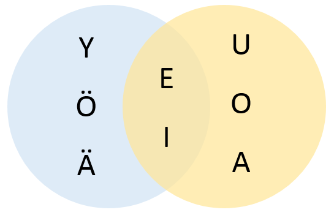

"# free-genai-bootcamp-2025" 

## TODO
- GenAI Architecting
- Test smaller versions of Deepseek & others for running locally

## Finnish rules learned 

### Vowel Harmony and addessive/inessive conjugation

[Vowel harmony](https://openlearning.aalto.fi/mod/page/view.php?id=3385%23%3A~%3Atext=Finnish%20has%20a%20vowel%20harmony)

- Non-compound words can only contain one group of vowerls 